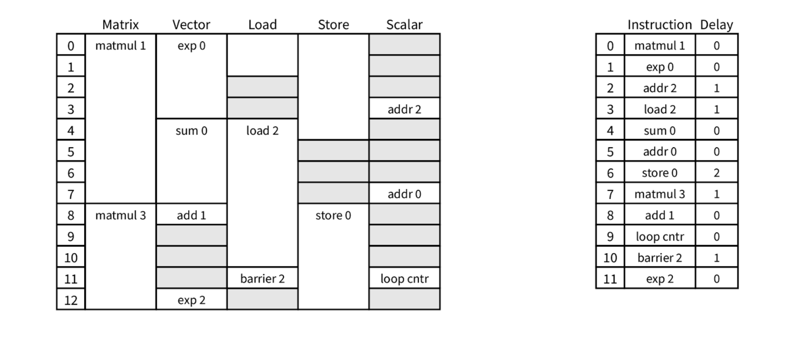

# Atlas NPU Subset — Hardware Accelerator Specification

> **Canonical human-readable spec.** Structured companions live beside this file:
> `spec.yaml`, `isa.yaml`, `interfaces.yaml`, `state.yaml`, `constraints.yaml`,
> `design_space.yaml`, `test_obligations.yaml`, `provenance.yaml`.
>
> **Version:** 0.1.0 — **Maturity:** S2 (structured spec) working toward S3/S4.
> **Scope (frozen for this revision):** the repo ISA only (the ~131-instruction
> RV32-style tensor ISA implemented in `npu_model`). The legacy 258-op TPU-LLO
> listing and any compiler/IR-integration choice are **out of scope**.

This document is both a **human architecture contract** and the prose face of a
**machine-readable generation contract**. It is precise enough that an
independent team could implement the same design, yet it deliberately does not
lock down RTL structure beyond what correctness, interface compatibility,
performance, or benchmark comparison require.

### Normative language

| Word | Meaning |
|------|---------|
| **MUST / SHALL** | Required for correctness. |
| **SHOULD** | Expected unless justified otherwise. |
| **MAY** | Optional implementation choice. |
| **MUST NOT** | Prohibited. |

### Claim status (every claim carries one; see `provenance.yaml`)

`normative` (must implement+test) · `reference` (observed, not required) ·
`assumption` (inferred; review) · `open` (known ambiguity) · `rejected`.

### Three layers this spec separates

| Layer | Question | Treatment here |
|-------|----------|----------------|
| **Architecture** | What is visible and guaranteed? | Primary content. |
| **Microarchitecture constraints** | What is required/constrained of an implementation? | Stated explicitly, labeled as such. |
| **Implementation** | How is it built? | Out of scope (RTL docs). |

### Spec maturity ladder

`S0` natural-language intent → `S1` human spec → `S2` structured spec →
`S3` executable spec → `S4` IR-ready → `S5` frozen benchmark. This revision is
**S2**: §1–§21 below are mirrored by typed YAML. The executable model
(`npu_model`) is the **evaluation oracle** (and an authoring source) — it is *not*
a stage the IR is derived from; the IR is generated from the spec. Full pipeline
in `00_intent.md`.

---

## 0. Document set, source of truth, and reading bundles

This spec is a **bundle**, organized by role (see `README.md`, `META.md`,
`manifest.yaml`): `human/*.md` (this narrative) and `machine/*.yaml` (a **typed node
graph**). **Source-of-truth policy:** `machine/*.yaml` is **canonical for every value
and claim**; `human/SPEC.md` is canonical for prose/rationale; they may never disagree
— `spec/lint.py` enforces it. Both are **hand-authored** (nothing is auto-generated);
IR/models/tests are *future* outputs generated from `machine/` (`machine/downstream.yaml`).

Each `machine/` entry is a **node** `{id, kind, status, attrs, refs, ...}` from a fixed
core kind vocabulary, extended by **dialects** (`dialects/`); the typed model + loader
live in `schema/`. The graph validates (`python spec/schema/load.py`) and lowers
mechanically to an SSA-style IR (`human/ir_mapping.md`). Conventions: `META.md`.

| Stage / role | Location |
|--------------|----------|
| S0 intent + workloads | `human/00_intent.md`, `human/workloads.md` |
| S1 human narrative | `human/SPEC.md` (this file) + annexes `human/{numerics,sw_interface,ir_requirements,ir_mapping}.md` |
| S2 typed node graph | `machine/*.yaml` (types, state, spec, isa, interfaces, constraints, design_space, test_obligations, cross_cutting, downstream, provenance, kernels) |
| Meta-model / tooling | `schema/{core,load}.py`, `dialects/npu.yaml`, `META.md`, `manifest.yaml`, `lint.py` |
| Assets | `assets/images/` |

**Reading bundles — sections that are ONE coupled story** (change one → re-read and
re-validate the whole bundle; machine-readable in `manifest.yaml:bundles`):

1. **Semantics** — §6 ISA ⇄ §7 numerics ⇄ §4 state (`isa.yaml`, `numerics.md`, `state.yaml`).
2. **Execution/memory/dataflow** — §8 memory ⇄ §9 scheduling/occupancy ⇄ §9.2 dataflow (`spec.yaml`, `isa.yaml`).
3. **Programmer interface** — §5 programmer's model ⇄ `sw_interface.md` ⇄ §15 errors ⇄ §2 open decisions.
4. **Perf/DSE/quality** — §12 constraints ⇄ §16 design-space ⇄ §13 quality ⇄ §3 workloads.
5. **Components/interfaces** — §10 components ⇄ §11 interfaces/connectivity.
6. **Verification** — §14 references all of the above.
7. **Traceability** — §2 provenance + §17 IR mapping span every section.

---

## 1. Overview and intent

**Design name:** `atlas_npu_subset` (the executable model names its default
configuration `SimpleNPU`). *(normative)*

The Atlas NPU subset is a **statically scheduled tensor accelerator for
edge-deployed VLA / Physical-AI inference** with low-precision, tile-oriented
execution. A small in-order **scalar control core** (RV32I-style) sequences a
**tile-oriented tensor datapath**: two matrix engines (**MXU0** systolic,
**MXU1** inner-product), a **vector unit (VPU)**, a **transform/transpose unit
(XLU)**, a **load/store unit (LSU)**, and a multi-channel **DMA** engine that
moves 32×32 tiles between off-chip **DRAM** and an on-chip banked scratchpad
**VMEM**. All architecturally-visible timing is **deterministic**, and
correctness does not depend on dynamic dependency tracking. *(normative)*

**Intended workloads:** GEMM (FP8→BF16), batched GEMM, attention (including
fused/flash attention), RMS-norm, softmax, activations (SiLU, GELU-tanh, ReLU,
transcendentals), elementwise add/sub/mul/div, RoPE, and requantization
(BF16→FP8). *(normative — see §3)*

**Non-goals:** general-purpose CPU replacement; full training support; dynamic
out-of-order execution; dynamic dependency scoreboarding. *(normative)*

**Integration context:** a memory-mapped inference accelerator. The host loads
an instruction image into IMEM and runs the core to a halt; completion is
observed by **polling** (no interrupts in the architectural model). *(normative)*

**Expected software stack:** static assembly programs assembled to 32-bit words
and loaded into IMEM. (Compiler/IR integration is intentionally not specified.)
*(reference)*

---

## 2. Source bundle and provenance

This spec is distilled from the artifacts below; per-claim status and the full
ledger live in `provenance.yaml`.

| Source | Role | Trust |
|--------|------|-------|
| `npu_spec/00..06/README.md` | Primary normative human spec (reconciled to perf model + RTL, commit `11598ec`). | high |
| `npu_model/` executable model | **Authoritative semantics & latencies** (`hardware/{mxu,vpu,lsu,dma,bank_conflict,arch_state}.py`, `configs/isa_definition.py`, `isa_types.py`). | high for semantics |
| `npu_model/configs/hardware/default.py` | Concrete sizes; some timing fields are **dead** (EUs use hardcoded dicts). | high sizes / med timing |
| `npu_model/configs/programs/*`, `workload/*` | Application contract & numeric tolerances. | high |
| `tests/*` | Verification obligations and oracles. | high |
| `npu_speed_of_light/simple_throughput_model.py` | Rooflines / perf targets. | medium |

> **Why this matters:** keeping intended vs observed vs inferred behavior
> separate is the entire point of the ledger. The semantics, ISA, state,
> scheduling, and memory model are pinned down; what remains are **four bounded
> ratification decisions** an architect must make before freezing a benchmark
> spec (none requires new semantics — each is a value/encoding choice):
>
> 1. **Scalar register width** — RV32 (recommended normative) vs the RV64
>    behaviors the model mixes in (6-bit shamt, 64-bit unsigned compares). (§4)
> 2. **VMEM bus width** — 256-bit (recommended normative, matches frozen params)
>    vs 512-bit (`default.py`); changes the VMEM roof and DMA VMEM-side time. (§11, §12)
> 3. **DRAM aperture** — confirm the architectural intent of 16 GiB (tagged
>    `assumption`) vs the 1 GiB sim default. (§4)
> 4. **Host transport / status** — no MMIO control block or architected
>    START/STATUS/ERROR CSRs exist yet; the host lifecycle (§5) is defined but its
>    binding is implementation-defined. (§5, §15) — note `npu_spec` *does* intend a
>    control plane (enable/halt/status/stop-reason) and a full RV32I ABI; what's
>    missing is the concrete register map. (`sw_interface.md`)
>
> **Model defects to fix (not architecture decisions; `npu_spec` already resolves):**
> (a) `dma.config` vs `dma.wait` — `npu_spec` gives distinct `funct7`
> (`0x00`/`0x01`); the model collides both at `0x01`. (b) PC units — `npu_spec`
> defines PC as a **word index (+1)**; the model uses a byte address (+4). (c) ERF
> scale — `npu_spec` calls `e` an **E8M0** (power-of-2) exponent; the model
> multiplies by the raw integer. In each, **`npu_spec` is normative; fix the model.**

---

## 3. Workloads and application contract

Workload support is part of the architecture. Kernels are written as static
assembly programs over 32×32 tiles. *(normative)*

**Data types:** FP8 (`float8_e4m3`) for matrix operands; BF16 for activations,
accumulation, and most vector math; FP32 only in reference/golden code. *(normative)*

**Tile and layout:** the architectural tile is **32×32**. A tensor register
holds one 32×32 FP8 tile or one 32×16 BF16 half-tile; a full 32×32 BF16 tile
occupies two consecutive registers. Kernels use shapes that are multiples of 32
(observed M/N/K and sequence lengths ∈ {32, 64, 96, 128}). VMEM staging is
typically **column-blocked** for vector kernels and **tiled** for matmul. *(normative)*

**Kernel families** (full list with shapes/oracles in `test_obligations.yaml`):

| Family | Operation | In→Out dtype | Engine(s) |
|--------|-----------|--------------|-----------|
| GEMM | `C = A·B` (+bias) | FP8 → BF16 | MXU |
| Batched GEMM | per-batch GEMM | FP8 → BF16 | MXU |
| Fused matmul+bias | GEMM then bias add | FP8/BF16 | MXU+VPU |
| RMS-norm | `x·rsqrt(mean(x²)+eps)` | BF16 | VPU |
| Softmax | row-stable `exp(x-max)/Σ` | BF16 | VPU |
| SiLU / GELU(tanh) | activations | BF16 | VPU |
| Fused silu-gate / norm-scale | fused activation×gate | BF16 | VPU |
| RoPE | freq matrix + sin/cos | BF16 | VPU |
| Reduction-sum | row/col reduce | BF16 | VPU |
| Requant | BF16 → FP8 (`vpack`) | BF16 → FP8 | VPU |
| Elementwise | add/sub/mul/div | BF16 | VPU |
| Fused/flash attention | online-softmax SDPA | BF16 (FP8 in matmul) | MXU+VPU |

**Performance-critical kernels:** GEMM and attention (they dominate MXU
utilization and define the rooflines in §12). *(reference)*

---

## 4. Architectural state

Full table in `state.yaml`. **Architectural** state affects visible behavior;
**implementation** state (NPC latch, per-EU in-flight counters, bank-checker
tables, randomization seed) is excluded.

| State | Kind | Size / count | Notes | Status |
|-------|------|--------------|-------|--------|
| **XRF** | scalar regfile | 32 × 32-bit | `x0` hardwired 0, writes dropped | normative (width open) |
| **ERF** | scale regfile | 32 × 8-bit | FP8 quantization scale factors | normative |
| **MRF** | tensor regfile | 64 × 1024 B | 32×32 FP8 / 32×16 BF16; pair = 32×32 BF16 | normative |
| **CSRF** | CSR file | 4096 × 32-bit | general scratch; no architected control CSRs yet | reference |
| **IMEM** | memory | 128 KiB | holds 32-bit words; indexed `pc/4` | normative |
| **VMEM** | scratchpad | 1 MiB, 8 banks, 32 B granularity | sole on-chip tensor staging; **0-based byte offsets** | normative |
| **DRAM** | external mem | 16 GiB | DMA-only; effective addr = `(dma_base<<32) \| offset` | size: assumption |
| **Weight slots** | per-MXU buffer | 2 × 1024 B per MXU | 32×32 FP8 weight tile | normative |
| **Accumulators** | per-MXU buffer | 2 × 2048 B per MXU | 32×32 BF16 | normative |
| **DMA base** | register | 32-bit | upper 32 bits of DRAM address (single, shared) | normative |
| **Sync flags** | flag array | 8 (one per DMA channel) | busy from issue to completion | normative |
| **PC** | control | **word index** (npu_spec, +1) | model uses byte addr (+4, `instructions[pc/4]`) — discrepancy, see `provenance.yaml:pc.units` | normative (npu_spec) |
| **halted** | status flag | 1 bit | set by `ecall`/`ebreak` | normative |

> **Address-space note (truthfulness).** Each memory region is addressed from **0**
> in the executable model and in all kernel programs: VMEM is `vmem[byte_offset]`,
> DRAM is `dram[(dma_base<<32)|offset]`, IMEM is `instructions[pc/4]`. The high base
> constants `0x0002_0000 / 0x2000_0000 / 0x8000_0000` are an `npu_spec` *system
> address-map convention* (for a future SoC integration) and are **not** added by
> the model — do not assume them in kernels. *(addressing-from-0: normative; high
> bases: reference — see `provenance.yaml:memory_map.bases`)*

Reset values are **unspecified** except `x0` (always 0). Software MUST NOT rely
on reset contents. *(assumption — see `provenance.yaml:init.reset_values`)*

---

## 5. Programmer's model

**Memory map.** Each region is addressed from **0** by the model and kernels
(left column); the high system-map bases (right column) are an `npu_spec`
convention for SoC integration and are **not** applied by the executable model.

| Region | Model addressing | Size | System-map base (`reference`) |
|--------|------------------|------|-------------------------------|
| IMEM | `instructions[pc/4]`, PC byte addr | 128 KiB | `0x0002_0000` |
| VMEM | 0-based byte offset | 1 MiB | `0x2000_0000` |
| DRAM | `(dma_base<<32) \| offset` | 16 GiB (`assumption`) | `0x8000_0000` |

**Control / completion.** The host writes the instruction image into IMEM and
begins execution at PC 0. The program ends by reaching `ecall`/`ebreak` (sets the
**halted** flag, observed by polling) **or** by the PC running past the last
instruction (`pc >= len*4`). Fatal classes (§15) abort rather than set `halted`
in the current model. There is no MMIO control block or interrupt controller in
this revision; the 4096-entry CSR space is general scratch. *(normative;
architected control CSRs are `open` — see `sw_interface.md`)*

**Memory loading.** IMEM is loaded by the host before run. VMEM is filled by DMA
from DRAM or by scalar/tensor stores. DRAM is the off-chip backing store and is
reachable **only** through DMA. *(normative)*

**DMA programming.** Per channel `chN` (N∈0..7): `dma.config.chN` sets the DRAM
base; `dma.load.chN` / `dma.store.chN` move bytes (length in `rs2`);
`dma.wait.chN` fences the frontend until that channel completes. *(normative)*

**Alignment rules** *(normative)*:

| Access | Alignment |
|--------|-----------|
| Instruction fetch | 4 B |
| `lb/lbu/sb`, `seld` | 1 B |
| `lh/lhu/sh` | 2 B |
| `lw/sw` | 4 B |
| `vload/vstore` (VMEM tile) | 32 B |
| DMA source/dest, DMA size | 32 B |

**Host lifecycle.** *(normative intent; the host transport is `open`)*
1. **Reset** clears `x0` (reads 0) and `halted`; all other state
   (XRF/ERF/MRF/CSR/VMEM/DRAM) is **uninitialized** — software MUST initialize
   any state it reads.
2. The host **loads** the instruction image into IMEM (32-bit words from PC 0)
   and stages inputs into DRAM (and/or VMEM).
3. Execution **begins** at PC 0 and runs in program order.
4. Execution **ends** when an instruction sets `halted` (`ecall`/`ebreak`) or the
   PC runs past the last instruction (`pc ≥ len·4`). Fatal classes (§15) abort.
   The host observes normal completion by **polling** `halted`.
5. The host reads results back from DRAM/VMEM.

> The concrete host transport (how IMEM is written, how `halted` is observed,
> whether a START strobe exists, MMIO addresses) is **`open`**: the ISA defines
> no MMIO/CSR control block today (§state.yaml `csrf`). A driver-facing revision
> SHOULD add architected START/STATUS/ERROR CSRs and a memory-mapped IMEM
> aperture. Until then this lifecycle is the architectural contract; the binding
> is implementation-defined.

**Error/halt classes** are listed in §15.

---

## 6. ISA and operation semantics

The ISA is 32-bit fixed-width, 4-byte aligned, single-issue, in-order. Full
encodings and per-instruction semantics are in `isa.yaml`. Formats: scalar
R/I/S/SB/U/UJ and CSR (RISC-V layout); tensor VLS (load/store), VR (reg-reg),
VI (immediate). *(normative)*

> **Binary-encoding caveat (must read before building a decoder/assembler).** The
> executable model is **mnemonic/assembly-driven**: it dispatches on the decoded
> instruction object's `EXU` field (and `funct3` for the DMA channel), and it
> **never decodes a 32-bit word back into an instruction**. The model's
> `to_bytecode()` packers are therefore unexercised and contain **known bugs**
> (the VR packer shifts `vs2` by 19 so it overlaps `vs1`; the I-type packer
> overwrites `rd` with `imm`). Consequently, **only the declared field _values_**
> (opcode, funct3/funct7/funct2, the VR/VI/VLS operand assignments, and
> `funct3 = DMA channel`) **are authoritative** — the *bit placement* is not.
> An implementer MUST define a clean, collision-free bit layout from the field
> widths below and resolve the `dma.config`/`dma.wait` overlap (give `dma.wait` a
> distinct `funct7`). Recommended bit layout (matches `isa.yaml:encoding.formats`):
>
> | Fmt | 31:25 | 24:20 | 19:15 | 14:12 | 11:7 | 6:0 |
> |-----|-------|-------|-------|-------|------|-----|
> | R   | funct7 | rs2 | rs1 | funct3 | rd | opcode |
> | I   | imm[11:0] (31:20) | — | rs1 | funct3 | rd | opcode |
> | S   | imm[11:5] | rs2 | rs1 | funct3 | imm[4:0] | opcode |
> | SB  | imm[12,10:5] | rs2 | rs1 | funct3 | imm[4:1,11] | opcode |
> | U/UJ | imm (31:12) | | | | rd | opcode |
> | VLS | imm[11:0] (31:20) | — | rs1 | funct2(14:13) | vd[5:0] (12:7) | opcode |
> | VR  | funct7 | vs2[4:0] | vs1[6:0] (19:13) | — | vd[5:0] (12:7) | opcode |
> | VI  | imm16 (31:16) | | | funct3(15:13) | vd[5:0] (12:7) | opcode |
>
> *(field values: normative; bit placement: implementer-defined, this layout
> recommended — see `provenance.yaml:isa.binary_encoding`)*

### Families

- **Scalar integer** (EXU `SCALAR`, 1 cycle): `add sub sll slt sltu xor srl sra
  or and` (R, opcode `0b0110011`); `addi slti sltiu xori ori andi slli srli
  srai` (I, `0b0010011`); `lui` (`0b0110111`), `auipc` (`0b0010111`).
- **Control flow** (1 cycle, **2 delay slots**): `beq bne blt bge bltu bgeu`
  (SB, `0b1100011`); `jal` (UJ, `0b1101111`); `jalr` (I, `0b1100111`).
- **CSR** (`0b1110011`): `csrrw csrrs csrrc csrrwi csrrsi csrrci`. *(reference)*
- **Control misc:** `fence` (`0b0001111`), `ecall`/`ebreak` (`0b1110011`,
  imm 0/1 → halt), `delay` (`0b1100111`/f3=1, scheduling no-op).
- **Scale-register I/O:** `seli` (load immediate into ERF, EXU `SCALAR`);
  `seld` (load ERF byte from VMEM, EXU `LSU`, **blocking**).
- **Scalar/tensor memory** (EXU `LSU`): `lb lh lw lbu lhu` (load, 2 cyc),
  `sb sh sw` (store, 1 cyc), `vload`/`vstore` (32×32 tile, 34 cyc) — all
  **blocking**. `vload/vstore` address = `x[rs1] + (imm << 5)`.
- **Vector (VPU)** (EXU `VECTOR`, `0b1010111`/`0b1011111`): binary BF16
  (`vadd vsub vmul vminimum vmaximum`); unary/transcendental (`vmov vrecip vexp
  vexp2 vrelu vsin vcos vtanh vlog2 vsqrt vsquare vcube`); reductions
  (`vredsum/min/max.bf16` column = 130 cyc; `.row.bf16` = 39/34 cyc);
  conversions (`vpack.bf16.fp8`, `vunpack.fp8.bf16`, with ERF scale);
  immediates (`vli.all/row/col/one` — imm16 is a **raw BF16 bit-pattern**).
- **Transform (XLU):** `vtrpose.xlu` (`0b1101011`) — 32×32 tile transpose.
- **Matrix (MXU)** (`0b1110111`, EXU `MATRIX_SYSTOLIC`/`MATRIX_INNER`,
  **blocking** for push/pop): `vmatpush.weight.{mxu0,mxu1}`;
  `vmatpush.acc.{fp8,bf16}.{mxu0,mxu1}`; `vmatpop.{fp8,bf16}.acc.{mxu0,mxu1}`;
  `vmatmul[.acc].{mxu0,mxu1}`. MXU consumes FP8 activation × FP8 weight,
  accumulates in BF16 (internal precision ≥ fp16); `.acc` adds into the
  accumulator, plain `vmatmul` overwrites it. `vmatpop.fp8` divides the
  accumulator by an ERF scale (truncating) and quantizes to FP8.
- **DMA** (EXU `DMA`): `dma.load.chN` (`0b1111011`/f7=0), `dma.store.chN`
  (f7=1), `dma.config.chN` (`0b1111111`/f7=1), `dma.wait.chN`. Channel = `funct3`.

> **`dma.config` vs `dma.wait` encoding (resolved by `npu_spec`; model defect).**
> `npu_spec/06` gives them **distinct `funct7`** — `dma.config = 0b0000000`,
> `dma.wait = 0b0000001` (both `opcode=0b1111111`, `funct3 = channel`) — so there
> is **no architectural ambiguity**. The **executable model has a defect**: it
> encodes *both* at `funct7=0b0000001`. Normative = `npu_spec` (distinct `funct7`);
> the model should be fixed. Note `dma.config` **uses `rs1`** as the base (only
> `rd` is reserved-zero); `dma.wait` is nullary (`rd=x0, rs1=x0`).

> **Branch/jump offsets are architectural displacements.** `beq/.../jal/jalr`
> targets are `PC + sext(offset)`; offsets are *not* adjusted by pipeline depth.
> (The executable model subtracts `PIPELINE_LATENCY*4` internally to align its
> 2-stage pipeline; this is an implementation artifact, not part of the contract.)
> Likewise `auipc`'s result is `(imm<<12) + address_of_auipc`.

### Normalized instruction entry (example)

```yaml
instruction:
  id: vmatmul.acc.mxu0
  family: matrix
  syntax: vmatmul.acc.mxu0 acc(vd), m(vs1), w(vs2)
  operands:
    - {name: vd,  type: accumulator,  direction: in_out}
    - {name: vs1, type: matrix_reg,   direction: input}   # FP8 activation tile
    - {name: vs2, type: weight_slot,  direction: input}   # FP8 weight tile
  semantics: [acc[vd] += m[vs1] @ w[vs2] (FP8×FP8 → BF16, internal ≥ fp16)]
  preconditions: [vd[5:1]==0, vs2[5:1]==0, weight_slot_resident, no_bank_conflict]
  postconditions: [accumulator_bf16_updated]
  completion: blocking_latency_class(mxu0_matmul = 96 cycles)
  illegal_cases: [accumulator_or_weight_bank_in_use_by_other_in_flight_op]
  verification: {directed: [gemm.fp8_bf16], equivalence: [eq.matmul]}
```

### Reserved-zero & pairing rules (decode MUST enforce) *(normative)*

Unary VPU/XLU ops set `vs2 = 0`; `vmatpush.*` set `vs2 = 0, vd[5:1] = 0`;
`vmatpop.*` set `vs1 = 0, vs2[5:1] = 0`; `vmatmul.*` set `vd[5:1] = 0,
vs2[5:1] = 0`; `dma.config` sets `rd = x0` (it *uses* `rs1` as the base);
`dma.wait` sets `rd = x0, rs1 = x0`. Pair-consuming ops
(full 32×32 BF16) name the **low** register of a consecutive pair; `reg = 63`
is illegal for such ops.

### Blocking instructions *(normative)*

`lb lh lw lbu lhu sb sh sw seld vload vstore vmatpush.weight.* vmatpush.acc.*
vmatpop.*` are defined as **architecturally blocking**: the static schedule MUST
treat each as occupying its functional unit for its full latency class and MUST
NOT issue a dependent (or same-unit) instruction before it completes — these do
not pipeline. Spacing is supplied by `delay`/independent work per §9. (Note
`vmatmul*` is *not* on this list — it may overlap with work on other units, but
still occupies its own MXU per the §9 occupancy rule.)

---

## 7. Data types and numerical semantics

*(normative unless noted; see `numeric_tolerances` in `test_obligations.yaml`)*

- **FP8** = `float8_e4m3` (E4M3, 1 byte). Used for matrix operands and as the
  packed/requantized output type. **Saturates** to the representable range on
  conversion.
- **BF16** = bfloat16 (2 bytes). Activations, accumulation, and most vector
  math. IEEE-style behavior.
- **FP32** appears only in reference/golden code (e.g. variance, stable softmax),
  not as an architectural operand type.
- **Accumulation:** the MXU forms products and partial sums at internal
  precision **≥ fp16** and rounds to a **BF16 accumulator**. RTL MAY use any
  internal width that meets the test tolerances. *(normative — see
  `provenance.yaml:mxu.accumulation_precision`)*
- **Conversions / (de)quantization:** `vpack.bf16.fp8` multiplies two BF16
  half-tiles by an ERF scale and casts to FP8; `vunpack.fp8.bf16` casts FP8 to
  BF16 and divides by the ERF scale. `vmatpop.fp8.acc.*` divides the BF16
  accumulator by an ERF scale with **truncating** rounding, then casts to FP8.
- **`vli` immediates** are raw 16-bit BF16 bit-patterns, not integers (the
  instruction's `imm16` field is bit-cast to BF16, e.g. `0x3C00 → 1.0`).
- **Transcendental / unary ops** (`vexp vexp2 vsin vcos vtanh vlog2 vrecip
  vsqrt`, and `vsquare/vcube/vrelu`): operate on BF16 and produce BF16. The
  contract is **match a float32 libm-class reference rounded to BF16 within the
  numeric tolerance** (default `1e-2`); implementations MAY use tables/polynomials
  that meet it. Rounding is round-to-nearest-even. Out-of-domain inputs
  (`vlog2(x≤0)`, `vrecip(0)`, `vsqrt(x<0)`) are **undefined and not tested**.
  *(reference math: the kernels' Python oracles in `npu_model/workload/`.)*
- **Tolerances:** default `rtol=atol=1e-2`; fused attention `5e-2`; SmolVLA
  attention `0.2`; bias-add-cast `1e-1`; matmul cross-check abs-error `< 4.0`.
  These are **verification tolerances**, not a promise of bit-exactness.

> Numeric edge cases are where LLM-generated RTL most often fails; they are
> first-class verification obligations (§14, `cov.numeric_edge`).

---

## 8. Memory model

*(normative; see `constraints.yaml:functional_requirements` and `memory_model`
in `spec.yaml`)*

- **Spaces:** IMEM (local, deterministic), VMEM (sole on-chip tensor staging),
  DRAM (off-chip, asynchronous). DMA is the **only** DRAM↔VMEM path.
- **Bank-conflict policy = software-managed and statically illegal.** Two
  in-flight instructions that access the **same bank** of a banked resource are a
  conflict; the model detects this at dispatch and raises `BankConflictError`.
  RTL MUST either guarantee conflict-freedom by construction (the static schedule
  does) or flag the violation — **silent corruption is prohibited.** *(normative)*
  The bank function for each resource is exactly:
  - **VMEM:** the conflict unit is the **32-byte line**. A byte range
    `[addr, addr+len)` occupies lines `addr>>5 .. (addr+len-1)>>5`; any shared
    line between two in-flight ops is a conflict. The conflict contract is at
    **32-byte-line granularity** (the model does **not** fold lines modulo a
    bank count). The "8 banks" figure is the **physical** SRAM organization that
    yields the 32 B/cycle VMEM roof (§12); the architectural exclusivity contract
    a scheduler must satisfy is per-32-byte-line. *(line granularity: normative;
    physical bank count 8: reference — see `provenance.yaml:vmem.bank_conflict_policy`)*
  - **MRF:** one bank **per register** (bank index = register index). A full
    32×32 BF16 op touches the register pair `{r, r+1}`; `vmov` touches only its
    single source/dest registers.
  - **MXU weight buffer:** one bank **per MXU** — both weight slots `w0,w1` of an
    MXU share it, so at most one weight-touching op per MXU may be in flight.
  - **MXU accumulator:** one bank **per MXU** — both `acc0,acc1` share it, so at
    most one accumulator-touching op (`vmatmul*`, `vmatpush.acc*`, `vmatpop*`)
    per MXU may be in flight. (Weight and accumulator banks are independent.)
- **Alignment / granularity:** tensor transfers and DMA are 32-byte aligned and
  sized in 32-byte multiples; scalar accesses follow their natural width (§5).
- **Ordering:** under the static schedule a VMEM reader observes the most recent
  **completed** writer (program order); there is no dynamic scoreboard.
- **DMA timing (frozen formula):** with off-chip 4 B/beat (2 cyc/beat, +2
  command words) and VMEM 32 B/beat (1 cyc/beat):
  - `dma_offchip_cycles = ceil((bytes + 8) / 4) * 2`
  - `vmem_transfer_cycles = ceil(bytes / 32) * 1`  *(open: 64 if 512-bit bus)*
  - `dma_transfer_cycles = max(offchip, vmem)` (≥ 1)
  Reference local transfers: 1024 B `vload/vstore` = 34 cyc; 1024 B FP8 push/pop
  = 32 cyc; 2048 B BF16 push/pop = 32 cyc.
- **DMA channelization:** 8 independent channels, at most one outstanding
  transfer per channel, independent completion state; `dma.wait.chN` fences the
  frontend until channel N is idle. Issuing to a busy channel is illegal (§15).

---

## 9. Execution and scheduling model

*(normative)*

- **Scheduling:** static, latency-annotated. Functional results are
  deterministic; on-chip timing is deterministic under the model's latency
  classes. **The compiler/programmer owns correctness of timing** — the hardware
  does no dynamic dependency tracking.
- **Issue:** single-issue, in-order. Frontend phases **IFU → IDU → EXU** with a
  pipeline latency of 2. At most one instruction issues per cycle.
- **Functional-unit occupancy (key contract).** Each non-DMA functional unit
  (MXU0, MXU1, VPU/XLU, LSU) executes **one** operation at a time and holds its
  issue port for the operation's **entire latency class**. Independent units MAY
  run concurrently. *Issuing an instruction to a unit that is still busy is a
  **schedule violation** (a backpressure error), NOT a stall.* It is therefore
  the static schedule's responsibility to guarantee a unit is free before issuing
  to it. *(normative — `idu.py` raises on backpressure for non-DMA units)*
- **The two blocking primitives** software uses to satisfy that obligation:
  - **`delay imm`** — the spacing primitive. It holds the frontend for `imm`
    cycles before issuing the next instruction, used to wait out a producer's
    latency (e.g. `delay 96` after a `vmatmul.mxu0` before reading its result).
  - **`dma.wait.chN`** — the only *data-dependent* fence. It stalls the frontend
    until DMA channel N's completion flag clears.
- **Data dependencies** (read-after-write through MRF/VMEM/weight/accumulator)
  are **not** checked dynamically. Two in-flight instructions that share a
  resource bank are a **bank-conflict error** (§8); the schedule must space a
  consumer after its producer's latency has elapsed. For two operations on the
  **same** functional unit, the occupancy rule above already forces the spacing;
  for **cross-unit** producer→consumer pairs, software inserts `delay`/`dma.wait`
  or independent work.
- **DMA is the exception to single-occupancy:** the DMA engine accepts up to 8
  queued transfers and does not block issue; each channel's flag is set when the
  transfer issues and cleared on completion. Issuing a second transfer to a
  channel whose flag is still set is illegal (§15).
- **Control flow:** branches and jumps have **2 architecturally-visible delay
  slots**; the two sequential instructions after a taken branch execute before
  redirect. A branch/jump in a delay slot is illegal (decode rejects it). *(The
  model's `-PIPELINE_LATENCY*4` target arithmetic is an implementation artifact;
  architecturally, branch/jump offsets are plain target displacements and are NOT
  pipeline-adjusted — see §6.)*
- **Four distinct notions of time** the spec keeps separate: functional ordering
  (program order); architectural timing guarantees (latency classes, delay
  slots, occupancy); performance-model timing (rooflines); RTL implementation
  latency (free, as long as the functional + architectural contracts hold).



*Figure (from `npu_spec`): the static-schedule model. Left — functional-unit columns
(Matrix / Vector / Load / Store / Scalar) showing concurrent occupancy over cycles
(e.g. `matmul 1` holds Matrix for its full latency while Vector runs `exp 0`). Right —
the program in issue order with the per-instruction **delay** used to space dependents.
Despite the source filename, this is **single-issue static scheduling with explicit
overlap + delay-based spacing**, not VLIW bundle issue (§9 occupancy rule).*

### 9.1 GEMM tiling and accumulation contract *(normative)*

The architecture is **weight-stationary**. A GEMM larger than one 32×32 tile is
decomposed into 32×32 tiles and a K-reduction:

1. **Load a weight tile** into an MXU weight slot with `vmatpush.weight.mxuX`
   (FP8, resident for as long as it is reused).
2. **Stream activation tiles** from MRF. The **first** K-tile uses `vmatmul.mxuX`
   (overwrites the accumulator); **subsequent** K-tiles use `vmatmul.acc.mxuX`
   (adds into the BF16 accumulator). Accumulation precision is internal ≥ fp16,
   architectural result BF16 (§7).
3. **Spacing.** Because all matmuls/pushes/pops to one MXU share that MXU's issue
   port *and* its weight/accumulator banks, a dependent op on the same MXU must
   be issued only after the producer's latency class elapses (MXU0 = 96, MXU1 =
   35, push/pop = 32). The static schedule enforces this with `delay` or by
   interleaving independent work on another unit.
4. **Drain.** Read results back to MRF with `vmatpop.bf16.acc.mxuX` (BF16 tile)
   or `vmatpop.fp8.acc.mxuX` (divide by an ERF scale, truncate, quantize to FP8),
   then `vstore`/DMA to memory.

Two MXUs MAY process independent output tiles concurrently. Multiple
accumulators (acc0/acc1) and weight slots (w0/w1) per MXU allow holding two
logical tiles, but the per-MXU bank rule (§8) means only one op per MXU is
in flight at a time. *(reference: weight-stationary is the repo model; alternate
dataflows are a DSE knob, §16.)*

### 9.2 Dataflow and on-chip communication *(normative)*

**Communication model: shared-register-file, not point-to-point.** Functional
units do **not** stream results directly to one another. Every datum moves through
one of three shared state hubs — **MRF** (the central operand hub for all compute),
**VMEM** (on-chip staging), and the **per-MXU local buffers** (weight slots,
accumulators) — plus **XRF/ERF** for scalars/scales. There is no crossbar or
unit-to-unit bus; the "interconnect" is the set of read/write ports onto these
files (§11), and concurrency on a shared file is governed by the bank-exclusion
rule (§8), not by dynamic arbitration. This is what makes the machine statically
schedulable.

**Canonical data-movement graph** (each edge names the instruction(s) that move
data across it):

```
        dma.load.chN                 vload                 vmatpush.weight / vmatpush.acc
 DRAM ───────────────▶ VMEM ───────────────▶  MRF  ──────────────────────────────▶ MXU weight slot / accumulator
   ▲   dma.store.chN     ▲   vstore            │  ▲                                          │
   │                     │                     │  │ vmatpop.{bf16,fp8}.acc                   │ vmatmul[.acc]  (reads
   └─────────────────────┘                     │  └──────────────────────────────────────────  activation from MRF,
                                               │                                               weight from slot,
   scalar: lb/lh/lw ◀──▶ VMEM ◀──▶ sb/sh/sw    │  VPU / XLU:  read MRF ─▶ compute ─▶ write MRF  accumulates in acc)
   seld: VMEM ─▶ ERF ;  seli: imm ─▶ ERF       │  (vadd…vtrpose, reductions, vli, vpack/vunpack)
                                               └── ERF feeds vpack/vunpack/vmatpop.fp8 as the scale factor
```

Normative consequences for an implementer:
- **DRAM is reachable only via DMA**; the only async seam is DRAM↔VMEM.
- **MRF is the sole operand source/sink for VPU/XLU and for MXU activations**, and
  the only path into/out of the MXU local buffers (weights enter via
  `vmatpush.weight` from MRF; results leave via `vmatpop` to MRF). The MXU never
  reads VMEM or DRAM directly.
- **VMEM is the only tensor path between DMA and compute** — there is no
  DMA→MRF or DRAM→MRF path; data lands in VMEM and is brought in by `vload`.
- **Weight slots and accumulators are private to their MXU** (no cross-MXU sharing).
- **Scales (ERF)** are loaded from VMEM (`seld`) or immediate (`seli`) and consumed
  by quantization ops only.

**Control ↔ communication coupling.** A single in-order frontend issues one
instruction per cycle; each instruction is the *only* thing that authorizes a
movement across an edge above. There is no autonomous DMA descriptor walking, no
prefetcher, and no cache — all movement is explicitly programmed. Cross-edge
ordering is the program's responsibility, enforced by the occupancy rule (§9),
`delay`, `dma.wait`, and the bank-conflict prohibition (§8). The performance model
(§12) costs each edge: DRAM↔VMEM by the DMA formula, VMEM↔MRF at 34 cyc/tile,
MRF↔local-buffer at 32 cyc/tile, compute by its latency class.

**Tile memory layout.** *Hardware-imposed (normative):* a tensor register is a
**32×32 row-major byte tile**; an FP8 tile occupies one register; a full 32×32
**BF16 tile occupies a register pair, split by column halves** — the low register
holds columns 0–15, the high register holds columns 16–31 (`write/read_mrf_bf16_tile`).
`vload`/`vstore` move **1024 contiguous VMEM bytes** ↔ one register; DMA copies raw
bytes (no reshaping). *Software/compiler convention (the canonical kernel layout,
feeds artifact G):* large M×K tensors are stored **tiled** — `(M_tiles × K_tiles)`
contiguous 32×32 blocks, with tile `(m,k)` at byte `(m·K_tiles + k)·1024`, so each
DMA is a contiguous 1 KB transfer; BF16 results are stored as the two 32×16 halves
at separate offsets. Non-multiple-of-32 shapes require padding — the padding/edge-
tile convention is a **compiler decision** (artifact G), not fixed by hardware.

**Concurrency capacity & what is deferred to microarchitecture.** The bank rules
(§8) define *exclusion* (which accesses may not coexist); the implementation MUST
provide enough MRF/VMEM banking and port bandwidth that **any** bank-conflict-free,
occupancy-legal static schedule runs **without added stalls** — that is the
architectural contract. The exact **port counts, internal datapath widths, and the
cycle-by-cycle micro-dataflow** (how the 96/35-cycle MXU latencies decompose into
weight-load / fill / stream / drain, systolic skew, and bus arbitration timing) are
**microarchitectural** and are deferred to the microarchitecture spec (artifact C,
§21). The architecture fixes *what moves where, under what ordering, at what
tile-granular latency*; the microarch fixes *how the movement is built*.

**Latency classes** (cycles; authoritative dicts in `hardware/{mxu,vpu,lsu}.py`):
MXU0 matmul 96 · MXU1 matmul 35 · MXU push/pop 32 · VPU pipelineable 66 · VPU
column reduction 130 · VPU row-redsum 39 · VPU row-redmin/max 34 · `vli` 65 ·
`vload/vstore` 34 · scalar load 2 · scalar store 1 · scalar ALU 1 · DMA config 1
· DMA transfer = formula (§8).

---

## 10. Component architecture

Per-component detail (state, ports, constraints) is in `spec.yaml:components`,
`state.yaml`, and `interfaces.yaml`. Topology names are **required constraints**;
internal fabric is implementation-defined.

- **Frontend (IFU/IDU):** single-stream fetch, single decode, single issue;
  enforces reserved-zero/pairing rules, 2-slot delay-slot bookkeeping, the `delay`
  spacing primitive, and the `dma.wait` fence; over-issue to a busy non-DMA unit
  is a schedule violation (§9). Visible state: PC.
- **SALU:** integer ALU, branch/jump target generation, CSR access, scale-reg
  I/O (`seli`/`seld`), DMA base programming, `delay`, halt-status. 1-cycle ops.
- **MXU0 (systolic, 96 cyc)** and **MXU1 (inner-product, 35 cyc):** FP8×FP8 →
  BF16 matmul; each has 2 weight slots (1024 B) and 2 accumulators (2048 B
  BF16), whole-register activation source, resident local weights, and a local
  FP8 quantization path for `vmatpop.fp8`. *(topology: reference)*
- **VPU (16 BF16 lanes):** BF16 elementwise/transcendental, row/column
  reductions, `vli`, and FP8↔BF16 pack/unpack. Operates directly on MRF.
- **XLU:** 32×32 tile transpose. MAY be a distinct datapath or a VPU mode (the
  model dispatches `vtrpose.xlu` through the vector EXU). *(reference)*
- **LSU:** scalar and tensor VMEM load/store and ERF byte load; 1 op in flight.
- **DMA:** 8-channel DRAM↔VMEM engine with per-channel completion and a shared
  base register.
- **VMEM / MRF:** banked scratchpad (8 banks / 32 B) and 64-register tensor file
  (one bank per register).

---

## 11. Interfaces and protocols

Full detail in `interfaces.yaml`. Specified independently of implementation;
transaction-level forms (the model's `peek`/`claim`) map to valid/ready in RTL.

- **Issue handshake (frontend→EU):** claim/peek (model) ⇒ valid/ready (RTL);
  backpressure supported; single-issue, program order.
- **MRF read/write ports:** 32 B/row; one bank per register.
- **VMEM bus:** **256-bit, 1 cyc/beat, 32 B/beat, 8 banks, 32 B granularity**
  — **`open`:** `default.py` configures 512-bit; resolve before freeze.
- **Off-chip link:** 32-bit, 2 cyc/beat, 4 B/beat, 2 command words overhead.
- **DMA channel:** request `{dram_addr, vmem_addr, length}`, 32 B aligned/sized,
  in-order per-channel completion flag, ≤1 outstanding, `dma.wait` fence, error
  on issue to a busy channel.
- **Weight/accumulator ports:** 1024 B / 2048 B per-MXU local buffers.
- **Connectivity (interconnect):** there is no crossbar/streaming fabric; units
  communicate only through the shared MRF/VMEM/local-buffer hubs per the
  data-movement graph in §9.2. The ports above ARE the interconnect.
- **Clock/reset:** single core clock; the only async boundary is DRAM↔VMEM via
  DMA; reset values unspecified except `x0`. *(assumption)*
- Interfaces SHOULD eventually export to IP-XACT-like metadata. *(open)*

---

## 12. Resource and performance constraints

Hard constraints, targets, and assumptions are kept separate in
`constraints.yaml`.

**Hard architectural constraints** *(normative):* VMEM 1 MiB / 8 banks / 32 B
granularity; IMEM 128 KiB; MRF 64×1024 B; ERF 32; XRF 32; 2 MXUs each with 2
weight slots + 2 accumulators; 32×32 tile; 8 DMA channels; 32 B DMA
align/granularity; 32-bit instructions; 2 delay slots.

**Functional requirements** *(normative):* `dma.wait` must not complete early;
VMEM read-after-write observes the latest completed write; the static schedule
must be bank-conflict-free; `vmatmul.acc` accumulates while `vmatmul`
overwrites; matmul is FP8×FP8→BF16.

**Performance targets** *(target):* rooflines — DRAM 2 B/cycle; VMEM 32 B/cycle
(open: 64 if 512-bit); MXU0 ≈ 683, MXU1 ≈ 1872, total ≈ 2555 FLOP/cycle; GEMM-64
MXU utilization ≥ a reference threshold.

**Modeling assumptions** *(assumption):* DMA bandwidth = `max(offchip, vmem)`
beat model; on-chip latencies fixed; DRAM modeled as bandwidth only (no separate
access-latency term); initialization randomization (seed 42) is non-architectural.

---

## 13. Quality-of-implementation targets

For comparing direct-RTL, manual, and IR-mediated implementations
(`constraints.yaml:quality_of_implementation`):

| Metric | Label |
|--------|-------|
| Per-kernel cycle count vs reference schedule | **required** |
| Throughput, MXU utilization | **target** |
| Memory traffic, stall breakdown, frequency | **reference** |
| Area, power, energy/op | **stretch** |

PPA budgets (frequency/area/power) are **open** until an RTL target and process
are chosen.

---

## 14. Verification obligations

The spec defines **what** must be checked; the verification system decides **how
and when** (`test_obligations.yaml`).

- **Directed tests:** every registered kernel runs to completion and is checked
  against its golden DRAM output within tolerance (oracle = PyTorch reference and
  sim golden), across the documented shape sets.
- **Negative tests:** MRF/VMEM/weight/accumulator bank conflicts → error;
  DMA issue to a busy channel → error; misaligned scalar access / misaligned
  fetch / illegal opcode → halt-or-error; branch in delay slot → static reject.
- **Functional equivalence:** RTL must match the executable model within
  tolerances for all kernels; matmul (FP8 in, BF16 acc) is called out explicitly.
- **Protocol assertions:** single issue per cycle; issue handshake never drops a
  uop; `dma.wait` observes completion before release; exactly 2 delay slots;
  `x0` reads 0 / writes dropped.
- **Coverage goals:** every instruction family and every mnemonic exercised;
  each latency class observed; all 8 DMA channels (load/store/config/wait);
  numeric edge cases (FP8 saturation, BF16 pack/unpack round-trip, full-tile
  reductions).
- **Public vs hidden split:** a direct-from-spec baseline MUST receive only this
  spec — never hidden test answers.

---

## 15. Error handling and undefined behavior

Each invalid case has a defined response. The **model behavior** column states
what the executable model does today; the **required (HW)** column is the
architectural contract an implementation MUST meet. *(see
`provenance.yaml:vmem.bank_conflict_policy` and `:error.model_behavior`)*

| Case | Classification | Model behavior | Required (HW) |
|------|----------------|----------------|---------------|
| DMA issue to a busy channel | illegal | assertion → abort | error/flag |
| Bank conflict (MRF/VMEM-line/weight/acc) | illegal (SW must avoid) | `BankConflictError` → abort | detect/flag; **silent corruption prohibited** |
| Over-issue to a busy non-DMA unit (backpressure) | illegal (schedule violation) | `RuntimeError` → abort | detect/flag |
| Branch/jump in a delay slot | illegal | `RuntimeError` → abort | decode reject |
| Out-of-bounds VMEM/DRAM access | illegal | assertion → abort | error/flag |
| FP8 overflow on conversion | defined | saturate (torch `e4m3fn`) | saturate to FP8 max |
| Reserved-zero field nonzero | illegal | **not checked** (mnemonic-driven) | decode reject |
| Illegal instruction (bad opcode/funct) | illegal | **not reachable** (mnemonic-driven) | decode reject → error |
| Instruction-address misaligned | illegal | **not checked** (PC always ×4) | error |
| Misaligned scalar memory access | illegal | **not checked** | implementation-defined (decide) |
| Transcendental out-of-domain (`vlog2(≤0)`, `vrecip(0)`, `vsqrt(<0)`) | undefined | torch result (e.g. inf/nan) | undefined; not tested |
| `ecall` / `ebreak` | normal termination | set `halted` | set `halted` |
| PC past last instruction | normal termination | fetch stops | set `halted`/done |

**Error-response contract.** *Truthful note:* in the **current executable model**
the fatal classes surface as **Python exceptions that abort the simulation** —
they do **not** set `halted`, and there is no error-status register (only
`ecall`/`ebreak` set `halted`). The **architectural requirement** for hardware is:
each fatal class MUST stop execution deterministically and MUST be observable to
the host — the recommended binding is to set `halted` plus an **error-cause
register**. Because no status/error CSR is architected in this revision, a host
that polls `halted` cannot yet distinguish normal termination from a fault;
defining architected STATUS/ERROR CSRs is an **`open`** item tied to the
host-transport decision (§5, `sw_interface.md`). Leaving invalid cases
unspecified is dangerous because an implementer (human or LLM) will otherwise
invent behavior; hence every case above is enumerated with both its current model
behavior and its required hardware response.

---

## 16. Design-space parameters

Knobs an IR transform / DSE pass MAY vary, with what each affects and what must
be regenerated, are in `design_space.yaml`. Highlights: MXU topology and count;
MXU latency classes; VMEM bank count, capacity, and bus width; dataflow
(weight-/output-/row-stationary; the repo model is weight-stationary); weight/
accumulator buffer depths; VPU lane width; DMA channel count; pipeline depth
(= delay slots, ISA-visible); tile shape. Each knob is tagged
architecture / microarchitecture / software-compatibility and lists the models
and tests to regenerate. Instruction width, register naming, and FP8/BF16 formats
are **frozen** for v0 (changing them is a new ISA revision). The system-map base
addresses are a `reference` convention (the model addresses each region from 0,
§5), so they are an integration-time choice, not a frozen architectural value.

---

## 17. Mapping to LHWIR

This spec is written so the mapping to an IR is mostly mechanical. *(neutral —
no compiler-backend commitment is made here)*

| Spec concept | LHWIR object |
|--------------|--------------|
| Component | `module`, `instance`, `unit` |
| Instruction | `op_semantics`, `instruction`, `action` |
| State object | `state`, `memory`, `register_file`, `queue` |
| Interface | `port`, `channel`, `protocol` |
| Schedule | `schedule`, `phase`, `barrier` |
| Dataflow | `edge`, `token`, `tensor_layout`, `movement` |
| Constraint | `constraint`, `contract` |
| Test obligation | `test_intent`, `coverage_goal` |
| Design-space knob | `parameter`, `transform_target` |

---

## 18. Machine-readable structured spec

The `machine/` files are a **typed node graph** — the structured companion and the
intended input to IR/model/test generation. Every entry is a node
`{id, kind, status, attrs, refs, ...}` from a fixed core kind vocabulary
(`type, param, unit, state, port, channel, op, timing_class, edge, constraint, knob,
test_intent, coverage_goal, claim, source, decision, axis, artifact`), extended by
**dialects**. Authoring conventions: `META.md`. Typed model + validator: `schema/`.

```
spec/
  README.md  META.md  manifest.yaml  lint.py        # front door, conventions, index, gate
  human/   00_intent · workloads · SPEC · numerics · sw_interface · ir_requirements · ir_mapping (.md)
  machine/ types · state · spec · isa · interfaces · constraints · design_space ·
           test_obligations · cross_cutting · downstream · provenance · kernels (.yaml — node graph)
  schema/  core.py (typed meta-model) · load.py (loader/validator, --ssa smoke test)
  dialects/ npu.yaml (registered dialect: kernel, mxu_profile kinds)
  assets/images/                                    # diagrams
```

`op` nodes carry typed operands (`direction: def|use`) + a structured `effect`, so
def-use edges lower mechanically (see `human/ir_mapping.md`). `human/` prose and
`machine/` values are kept consistent by `lint.py` (critical-constant check); the
whole graph is validated by `schema/load.py`.

---

## 19. Claim schema

Every extracted claim is tracked with `id / status / source / confidence /
maps_to / unresolved_questions` (see `provenance.yaml`). Two illustrative
entries:

```yaml
# High-confidence reference claim
claim:
  id: mxu0.topology
  text: MXU0 is a systolic-array matrix engine; MXU1 is inner-product.
  status: reference
  source: [npu_spec_md, npu_model_exec]
  confidence: high
  maps_to: [component.mxu0.kind, component.mxu1.kind]

# Open claim a reviewer must resolve
claim:
  id: vmem.bus_width_bits
  text: VMEM data bus is 256 bits (32 B/beat).
  status: open
  source: [npu_spec_md, hw_config_default]
  confidence: medium
  maps_to: [interface.vmem_bus.width_bits, constraint.vmem.bandwidth]
  unresolved_questions:
    - npu_spec/02 freezes 256; default.py uses 512 — pick one as normative.
```

---

## 20. What is NOT in this spec

Excluded (belongs in implementation docs, scaffolds, or verification artifacts):
arbitrary RTL module names (unless externally visible), FSM encodings, pipeline-
register placement, implementation-only temporaries, tool-specific hacks, hidden
test answers, manual RTL, and tool/agent-specific instructions. Also excluded by
**scope decision**: the legacy 258-op TPU-LLO instruction listing and any
compiler/IR-integration choice (MLIR dialect vs LLVM intrinsics). The model's
randomization seed is a verification aid, not architecture.

---

## 21. Downstream artifacts and decision register (e2e completeness)

This is an **architecture** spec. It is necessary but **not sufficient on its own
to tape out a chip and ship a software stack** — by design (see §20). To make the
boundary explicit so nothing is a silent hole, this section enumerates every
downstream artifact a full program needs, its owner, what it depends on, and its
status. Companions already produced are in **bold**. Full machine-readable form:
`downstream.yaml`.

| # | Artifact | Owner | Depends on | Status |
|---|----------|-------|------------|--------|
| A | **SW/host-interface spec** (`sw_interface.md`) — program model, IMEM image, assembler/ABI, run-to-halt lifecycle, 0-based addressing, DMA sequence, + the MMIO/CSR/interrupt **decisions** | software/arch | open items 4,5 | **drafted** |
| B | **Numeric reference contract** (`numerics.md`) — FP8/BF16 exact behavior, conversions, the executable model as bit-golden, transcendental policy | arch/DV | — | **drafted** |
| C | Microarchitecture spec — pipeline stage boundaries, buffer/FIFO depths, arbitration, systolic fill/drain & how 96/35-cyc decompose, weight-stream timing, bank arbiters | microarch/rtl | this spec | **required next** |
| D | SoC integration spec — real bus (AXI/AXI-Lite/CHI), off-chip mem PHY (LPDDR/HBM) replacing the abstract link, interrupt lines, clock/reset/power pins, address decode, IP-XACT | soc/integration | open item 5; bus choice | required |
| E | DV plan + **bit-exact** reference — testbench arch, SVA assertion list, coverage model + closure targets, RTL-vs-model equivalence, perf-validation, regression/signoff criteria | verification | B, C | required (obligations in `test_obligations.yaml`) |
| F | PPA/PD constraints — process node, freq/area/power budgets, SRAM macro selection (8 VMEM banks + MRF), SDC, CDC at the DRAM seam, DFT (scan + MBIST), UPF power intent, floorplan, thermal | physical design | node/target choice | required (TBD in `constraints.yaml`) |
| G | Compiler / static scheduler contract — turns the §9 occupancy + §8 bank rules + latency classes into a code-gen/cost model; guarantees conflict-free, correctly-spaced schedules | software | this spec | required (out of scope by decision; the in-repo kernels are the hand-written reference) |

**The five open ratification decisions (§2)** gate items A/D/E/F and must be fixed
before freeze: (1) scalar width, (2) VMEM bus width, (3) DRAM aperture,
(4) `dma.config`/`dma.wait` encoding, (5) host transport + STATUS/ERROR CSRs.

> **Reading guide for the team.** Architecture (this spec) → ratify the 5 decisions
> → A,B (software can start; numeric golden fixed) → C (RTL can start) →
> E,F (DV + PD) → G (production compiler). Items C–F are separate disciplines that
> *hang off* this spec; A, B are architecture-adjacent and already drafted here.

---

## 22. Cross-cutting concerns (mostly undefined in v0)

These are first-class accelerator concerns the v0 architecture does **not** yet
decide. They are recorded **explicitly as `open`/undefined** (not silent holes) so
they are visible and decidable; the few facts we do have are tagged `reference`.
Structured form + per-axis sub-decisions: `cross_cutting.yaml`.

| Axis | Status | What we know (reference) | Undefined (open) |
|------|--------|--------------------------|------------------|
| **Interconnect / scale-out** | open | single instance; on-chip = shared MRF/VMEM hubs, no NoC (§9.2); off-chip = serial TileLink + PERIPH (`npu_spec/06`) | NoC topology, multi-tile/die, chiplets, collectives, partitioning |
| **Reliability (RAS)** | open | none defined; bank/bounds checks are correctness asserts, not RAS | ECC on VMEM/MRF & links, fault model, containment, logging/recovery, scrubbing |
| **Security / isolation** | open | single-tenant; only DRAM/VMEM bounds checks | memory protection/IOMMU, multi-tenant isolation, privilege modes, secure boot, attestation |
| **Power / clock / thermal** | open | single clock domain; DMA is the only async seam; PPA power is a *target* only | power domains, clock gating, DVFS, idle/sleep, retention, thermal throttling |
| **QoS / preemption / virtualization** | open | run-to-halt, one context; 8 DMA channels (no priorities) | preemption/context-switch, time-slicing, priority QoS, SR-IOV, state save/restore |
| **Capability / versioning** | open | spec versioned (0.1.0); no architected ID/feature register (CSRs are scratch) | ID/VERSION register, feature/capability bits, DSE-config discovery |

These do not block the current single-core, single-tenant contract, but each becomes
**mandatory** once the device is scaled, shared, or productized — and several land on
the downstream artifacts (`§21`/`downstream.yaml`): RAS/power → PD (F), security/QoS/
interconnect → SoC integration (D), capability register → SW interface (`sw_interface.md`).

---

## NPU-required sections — coverage map

| Required | Where |
|----------|-------|
| 1. Accelerator overview | §1 |
| 2. Supported workloads | §3 |
| 3. Tensor/data layout | §3, §4 |
| 4. FP8/BF16/F32 semantics | §7 |
| 5. ISA families (DMA, matrix, vector, transpose/XLU, scalar/control, load/store) | §6 |
| 6. Architectural state (VMEM, MRF, ERF, XRF, IMEM, sync flags, CSRs) | §4 |
| 7. Component architecture (frontend, SALU, MXU0/1, VPU, XLU, DMA, LSU, VMEM) | §10 |
| 8. Scheduling model | §9 |
| 9. Memory model | §8 |
| 10. Programmer's model | §5 |
| 11. Verification obligations | §14 |
| 12. Reference manual metrics | §12, §13 |
| 13. Design-space knobs | §16 |
| 14. Mapping to LHWIR | §17 |

---

## Spec review checklist

- [x] Every instruction semantically defined — §6 / `isa.yaml`.
- [x] Every state object declared — §4 / `state.yaml`.
- [x] All interfaces defined — §11 / `interfaces.yaml`.
- [x] Legal and illegal cases explicit — §6 (reserved/pairing), §15.
- [x] Numerical edge cases defined — §7.
- [x] Memory ordering and banking rules defined — §8.
- [x] Timing constraints separated from functional semantics — §9 (four notions of time).
- [x] Microarchitecture constraints labeled separately from architecture — throughout (topology, latency classes flagged).
- [x] All assumptions marked — `status: assumption` + `provenance.yaml`.
- [x] Open questions listed — §2 (five bounded ratification decisions) + `provenance.yaml`.
- [x] All claims traceable to sources — `provenance.yaml`.
- [x] Can the spec generate tests? — §14 / `test_obligations.yaml`.
- [x] Can the spec generate an IR skeleton? — §17 mapping + typed YAML.
- [x] Could another person implement from this spec without reading RTL? — **yes for the core** (ISA, state, scheduling/occupancy, memory/banking, numerics, GEMM dataflow are all pinned). The five §2 ratification decisions must be chosen first, but each is a bounded value/encoding choice with a recommended default, not a missing semantic.
- [x] Direct-Claude baseline receives exactly this spec, not hidden knowledge — §14 test split.
