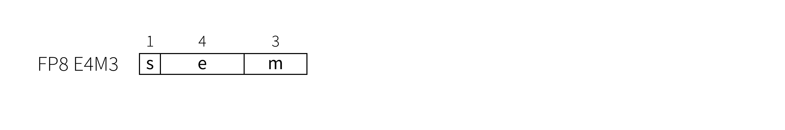
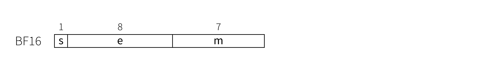
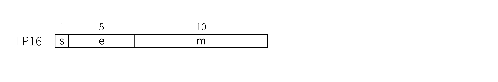
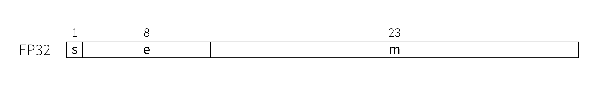

# Atlas NPU Subset — Numeric Reference Contract

> Companion to `SPEC.md §7`. Defines the **exact numeric behavior** an
> implementation must reproduce, and what the **bit-exact golden** is. Grounded in
> `npu_model` (`configs/isa_definition.py`, `hardware/arch_state.py`). The
> executable model is the golden for all *deterministic* operations; transcendentals
> are the one tolerance-bound exception and need a pinned reference for HW signoff.

## 1. Data types

| Type | Encoding | Notes |
|------|----------|-------|
| **FP8** | `float8_e4m3fn` — 1 sign, 4 exp (bias 7), 3 mantissa; **finite** (no ±inf), max finite ±448, has NaN, has subnormals | matrix operands; requant output |
| **BF16** | bfloat16 — 1 sign, 8 exp, 7 mantissa; IEEE-style incl. inf/NaN | activations, accumulation, vector math |
| **FP16** | IEEE half | **internal only** — MXU product/accumulate intermediate |
| **FP32** | IEEE single | reference/golden code only; not an architectural operand type |
| **INT32** | two's complement | XRF (see scalar-width open item, `SPEC.md §4`) |

> `e5m2` is **not** part of this design — it appears only as an unused diagram in the
> source `npu_spec/images/`; the model and ISA use `e4m3` exclusively.

### Bit layouts (from `npu_spec`, the source human spec)

| FP8 E4M3 | BF16 | FP16 | FP32 |
|----------|------|------|------|
|  |  |  |  |

## 2. Conversions and quantization *(model-exact)*

| Operation | Exact behavior |
|-----------|----------------|
| FP8 → BF16 | `fp8.to(bfloat16)` — exact (FP8 finite values are representable in BF16) |
| BF16 → FP8 (`vpack.bf16.fp8`) | `(concat(vs2,vs2+1) * e[es1]).to(float8_e4m3fn)` — multiply by ERF scale, then round-to-nearest-even + **saturate** to ±448 (torch `e4m3fn`) |
| FP8 → BF16 (`vunpack.fp8.bf16`) | `vs2.to(bfloat16) / e[es1]` — dequantize then divide by scale |
| Accumulator → FP8 (`vmatpop.fp8.acc`) | `trunc(acc_bf16 / e[es1]).to(float8_e4m3fn)` — **truncating** divide (`rounding_mode="trunc"`), then cast |
| Accumulator → BF16 (`vmatpop.bf16.acc`) | exact copy of the BF16 accumulator tile |
| `vli.*` immediate | the 16-bit field is a **raw BF16 bit-pattern** (`uint16` bit-cast to bf16), not an integer |

ERF scale factors are 8-bit (`e[es1] & 0xFF`). **Open discrepancy:** `npu_spec/06`
calls each `e` register an **`FP8_E8M0`** (power-of-2) exponent, i.e. the scale is
`2^e`; the executable model instead **multiplies by the raw integer value** of `e`.
This must be resolved — it changes every quantization result (see
`provenance.yaml:erf.scale_type`). The conversions above describe the *model's*
integer-multiply behavior; if E8M0 is chosen, `*e`/`/e` become `*2^e`/`/2^e`.

## 3. Matrix accumulation *(model-exact — this is the subtle one)*

`vmatmul[.acc].mxuX` computes, per the model:
```
act_fp16 = MRF[vs1].fp8 → fp16
wt_fp16  = weight_slot[vs2].fp8 → fp16
prod_fp16 = act_fp16 @ wt_fp16            # 32-wide dot products in fp16
result   = prod_fp16                       # vmatmul  (overwrite)
result   = prod_fp16 + acc[vd].bf16→fp16   # vmatmul.acc (accumulate)
acc[vd]  = result → bfloat16               # rounded to BF16 each matmul
```
**Normative contract:** products and the running sum are formed at internal
precision **≥ fp16**, and the accumulator is **rounded to BF16 after every
`vmatmul`** (so a K-tiled GEMM rounds to BF16 at each K-step — this is observable
and part of the contract). The bit-exact golden is the model's
`fp16-intermediate → bf16` sequence. RTL MAY use a wider internal datapath only if
it reproduces this rounding behavior within DV equivalence.

## 4. Vector / reduction ops *(model-exact)*

Elementwise (`vadd/vsub/vmul/vminimum/vmaximum`), `vmov`, `vsquare/vcube`,
`vrelu`, and the reductions (`vredsum/min/max[.row]`) are standard torch BF16 ops
with round-to-nearest-even; reductions broadcast the result across the reduced
dimension. These are **deterministic** → bit-exact golden = the model.

## 5. Transcendentals *(tolerance-bound — the one non-bit-exact class)*

`vexp, vexp2, vsin, vcos, vtanh, vlog2, vrecip, vsqrt` are computed by the model
as torch BF16 ops. These are **not guaranteed bit-identical** across libm/torch
versions or hardware. Contract: **match a float32 reference rounded to BF16 within
the numeric tolerance** (default `rtol=atol=1e-2`; `SPEC.md §7`,
`test_obligations.yaml`). Round-to-nearest-even. Out-of-domain inputs
(`vlog2(≤0)`, `vrecip(0)`, `vsqrt(<0)`) are **undefined and not tested**.

> **HW signoff action:** for bit-exact RTL equivalence, the program MUST pin an
> exact hardware reference for each transcendental (fixed polynomial/LUT) and
> re-baseline the golden from it. Until then, transcendentals are verified by
> tolerance only.

## 6. Golden model and signoff policy

| Op class | Golden | Equivalence |
|----------|--------|-------------|
| Conversions, pack/unpack, matmul, elementwise, reductions, `vli`, transpose | **executable model (bit-exact)** | RTL must match bit-for-bit |
| Transcendentals | float32 reference rounded to BF16 | tolerance (`1e-2` default) until a HW reference is pinned |
| Whole kernels | per-kernel PyTorch oracle in `npu_model/workload/` | tolerance per `test_obligations.yaml` (attention 5e-2, smolvla 0.2, bias_add_cast 1e-1) |

Tolerances are **verification thresholds**, not a promise of bit-exactness; the
deterministic-op golden is exact.
